## A. LeetCode premium

### 1350. Students With Invalid Departments

1. Input

Departments table:

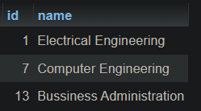

Students table:

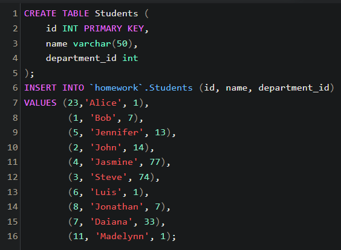

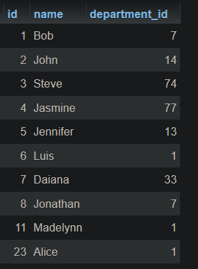

2. Output

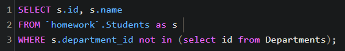

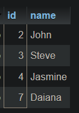

### 1777. Product’s Price for Each Store

1. Input

Products table:

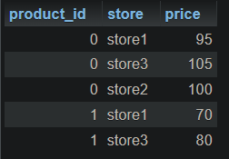

2. Output

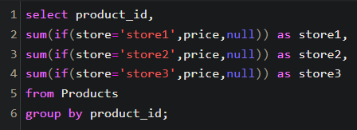

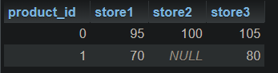

### 1565. Unique Orders and Customers Per Month

1. Input

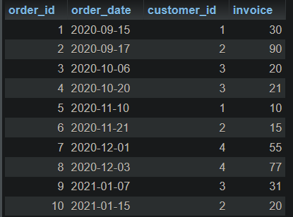

2. Output

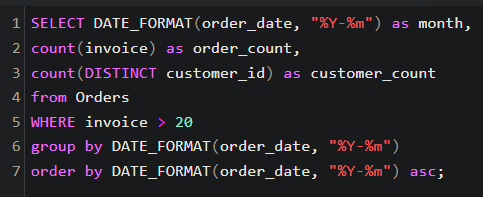

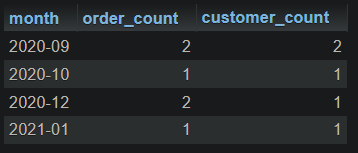

### 1173. Immediate Food Delivery I

1. Input

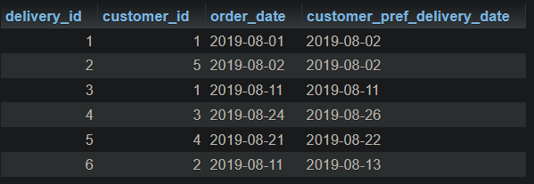

2. Output

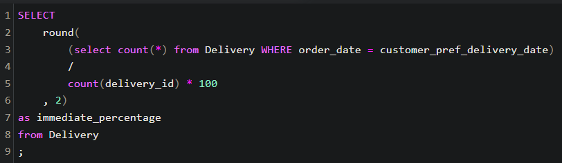

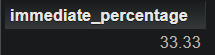
