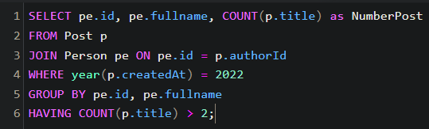
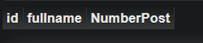

## 1. Hiển thị các bài viết của Person làm nghề Programmer được tạo sau ngày 01/01/2020

## 2. Tính tổng số lượng bài Post trong năm 2022

## 3. Hiển thị thông tin người dùng có bài Post trong năm 2022

## 4. Hiển thị thông tin người dùng và title bài Post của 3 bài post mới nhất

## 5. Thống kê số lượng bài Post của từng người

## 6. Thống kê số lượng bài Post của những người ở China

## 7. Thống kê số lượng bài Post của những người có sở thích Swimming trong năm 2023

## 8. Tìm kiếm tháng có nhiều bài post nhất trong năm 2023

## 9. Tìm kiếm năm có ít bài post nhất

## 10. Tìm kiếm năm có nhiều bài post nhất

## 11. Hiển thị thông tin người dùng có nhiều bài post nhất trong năm 2023

## 12. Hiển thị thông tin những người dùng có nhiều hơn 2 bài post trong năm 2022

