## LeetCode Premium

### 1082. Sales Analysis I

1. Input

- Product table:

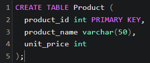

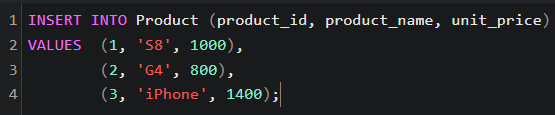

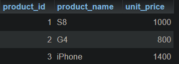

- Sales table:

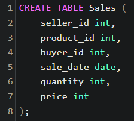

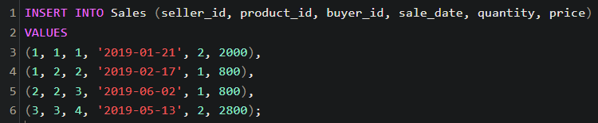

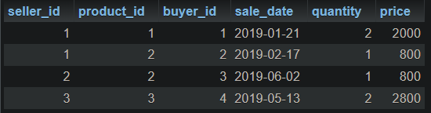

2. Output

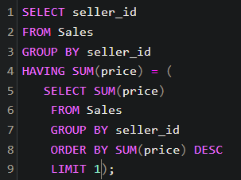

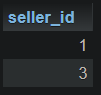

### 2072. The Winner University

1. Input

- Table: NewYork

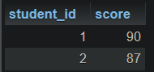

- Table: California

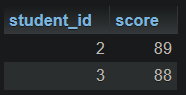

2. Output

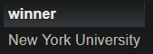
