## Leet Code Premium

### 1303. Find the Team Size

1. Input

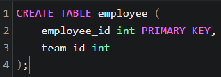

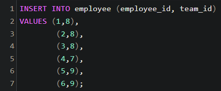

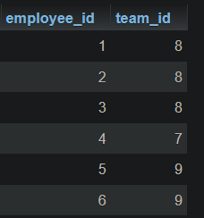

2. Output

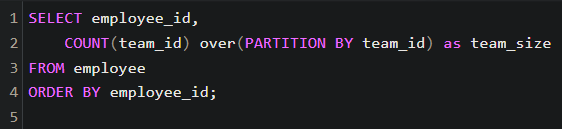

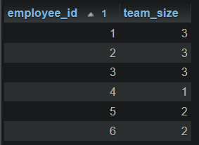

### 1571. Warehouse Manager

1. Input

Warehouse table:

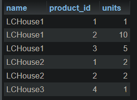

Products table:

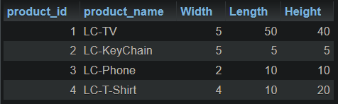

2. Output

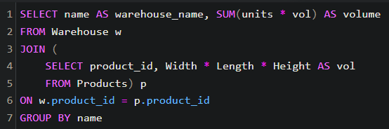

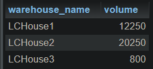

### 2339. All the Matches of the League

1. Input

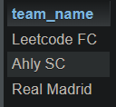

2. Output

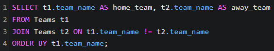

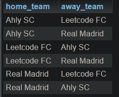

### 1623. All Valid Triplets That Can Represent a Country

1. Input

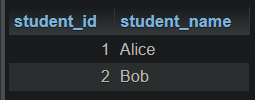

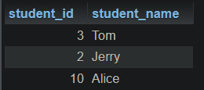

2. Output

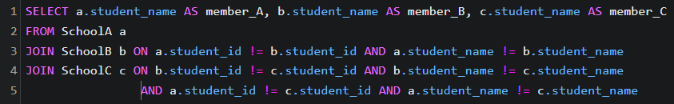

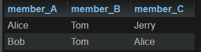

### 1421. NPV Queries

1. Input

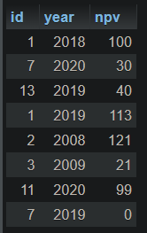

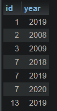

2. Output

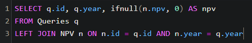

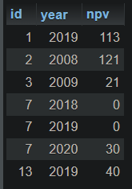

### 1069. Product Sales Analysis II

1. Input

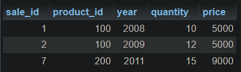

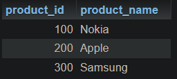

2. Output

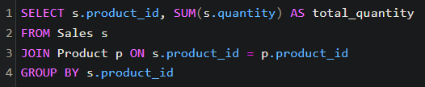

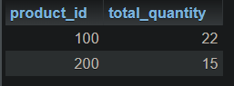
