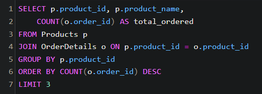
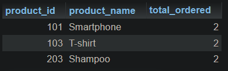

# Bài làm kiểm tra giữa môn CSDL - Nguyễn Thị Mai Quyên

1. Lấy thông tin tất cả các sản phẩm đã được đặt trong một đơn đặt hàng cụ thể.

2. Tính tổng số tiền trong một đơn đặt hàng cụ thể.

3. Lấy danh sách các sản phẩm chưa có trong bất kỳ đơn đặt hàng nào.

4. Đếm số lượng sản phẩm trong mỗi danh mục. (category_name, total_products)

5. Tính tổng số lượng sản phẩm đã đặt bởi mỗi khách hàng (customer_name, total_ordered)

6. Lấy thông tin danh mục có nhiều sản phẩm nhất (category_name, product_count)

7. Tính tổng số sản phẩm đã được đặt cho mỗi danh mục (category_name, total_ordered)

8. Lấy thông tin về top 3 khách hàng có số lượng sản phẩm đặt hàng lớn nhất (customer_id, customer_name, total_ordered)

9. Lấy thông tin về khách hàng đã đặt hàng nhiều hơn một lần trong khoảng thời gian cụ thể (customer_id, customer_name, total_orders)

10. Lấy thông tin về các sản phẩm đã được đặt hàng nhiều lần nhất và số lượng đơn đặt hàng tương ứng (product_id, product_name, total_ordered)

